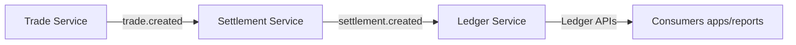
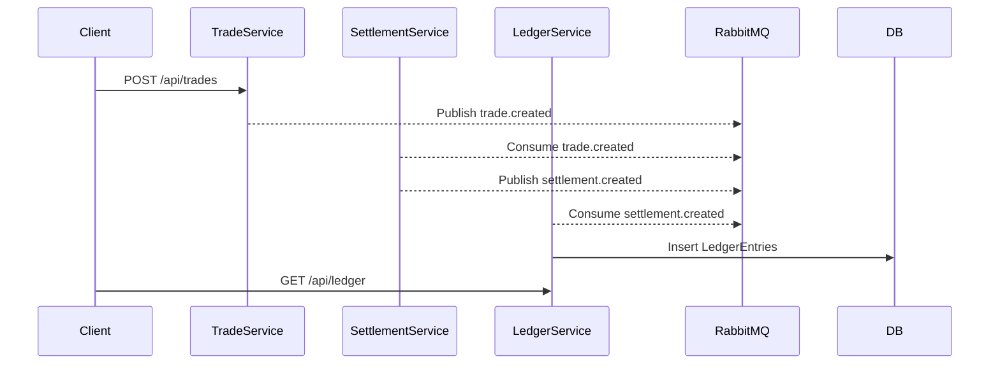

# FinLedger — Event-Driven Trade Settlement & Ledger System
[](https://github.com/tenel4/finLedger/actions/workflows/ci.yml)
[](https://codecov.io/gh/tenel4/finLedger)


## Overview
FinLedger is a production-grade, event-driven system that simulates the lifecycle of trades in capital markets:
- **Trade Service** — accepts trades and publishes `trade.created` events.
- **Settlement Service** — consumes trades, applies T+2 logic, computes fees/amounts, publishes `settlement.created` events.
- **Ledger Service** — consumes settlements, records double-entry ledger transactions (cash/securities), exposes query APIs.

The system demonstrates:
- Event-driven architecture with RabbitMQ
- Microservices with Spring Boot, Spring AMQP, JPA, Flyway
- Idempotency and DLQ handling
- Metrics & observability (Spring Boot Actuator + Prometheus, Grafana dashboards)
- Distributed tracing with OpenTelemetry + Tempo
- Integration testing with Testcontainers (skipped in this repo for now)
---

## Architecture

### High-Level System Diagram




---

## Quick Start

### Requirements
- JDK 17+
- Docker + Docker Compose
- Maven

### Start Infrastructure
```bash
docker-compose up -d
```
This runs the folllowing containers:
- **PostgreSQL** - database (port `5432`)
- **RabbitMQ** - messaging with management UI at http://localhost:15672 (guest/guest), Prometheus metrics at `:15692`
- **OpenTelemetry Collector** - receives traces/metrics on ports `4317` (gRPC) and `4318` (HTTP)
- **Tempo** - distributed tracing backend (port `3200` for queries, `9095` for gRPC ingestion)
- **Prometheus** - metrics scraping and storage (UI at http://localhost:9090)
- **Grafana** - dashboards and visualization (UI at http://localhost:4000, anonymous login enabled)

### Run Services
In three terminals:
```bash
cd trade-service && mvn spring-boot:run
cd settlement-service && mvn spring-boot:run
cd ledger-service && mvn spring-boot:run
```

### API Examples
* Create Trade:
```bash
curl -X POST http://localhost:8080/api/trades \
     -H "Content-Type: application/json" \
     -d '{"symbol":"AAPL","side":"BUY","quantity":100,"price":785.00,"currency":"USD","buyerAccountId":"...","sellerAccountId":"..."}'
```
* Query Ledger:
```bash
curl "http://localhost:8082/api/ledger?accountId=...&currency=USD"
```
---

## Metrics & Observability
- Actuator endpoints exposed under `/actuator/*`
- Prometheus metrics available at `/actuator/prometheus`
---

## Observability Stack
This project ships with a monitoring stack via Docker Compose:
- **Prometheus** scrapes metrics from services and RabbitMQ
- **Grafana** provides dashboards at `http://localhost:4000`
- **Tempo** stores distributed traces
- **OpenTelemetry Collector** receives telemetry from services and forwards to Tempo/Prometheus

You can explore:
- Service metrics at Prometheus: http://localhost:9090
- Dashboards at Grafana: http://localhost:4000
- RabbitMQ metrics at http://localhost:15692/metrics
---

## Continous Integration (CI/CD)
This project includes a GitHub Actions workflow (`.github/workflows/ci.yml`) that:
- Builds all services with Maven
- Runs Flyway migrations for each service
- Validates the project on every push and pull request
---

## Tech Stack
- **Backend:** Java 21, Spring Boot, JPA/Hibernate, Flyway
- **Messaging:** RabbitMQ
- **Database:** PostgreSQL
- **Testing:** JUNIT 5, Testcontainers
- **Observability:** Spring Boot Actuator, Micrometer, Prometheus
---

## License
This project is licensed under the MIT license.

